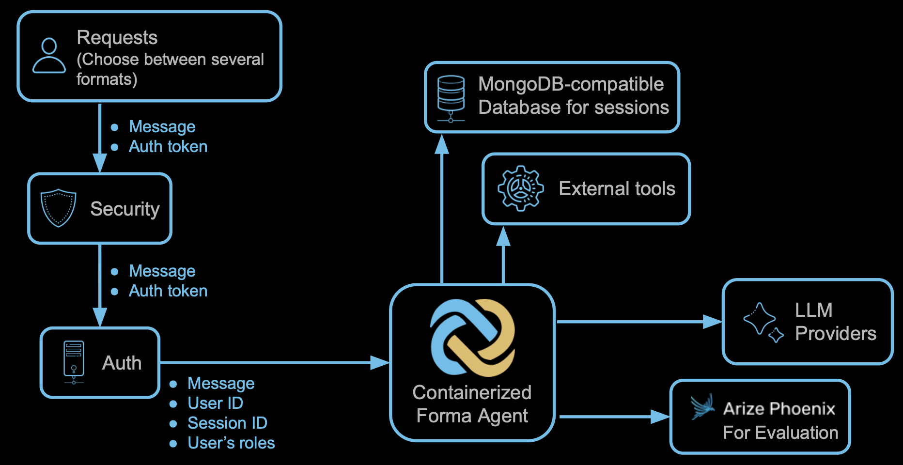

# Architecture Overview

> ⚠️ This section is a work in progress

Because Forma agents are meant to integrate into *your* systems, they do not enforce a single architecture. Despite this, you need to be aware of certain considerations and opinionated decisions.

1. **Forma agents are deployed as containers**, wherever you want.
2. **It is your job to prevent access to the Forma agent** by setting up networking, firewalls and other security mechanisms. 
3. **Forma agents do not have any means for authentication**. They will receive the user's roles and ID, and the session id. While the Forma agent will verify that the retrieved Session ID belongs to the User, it will not question the user ID itself.
4. **Forma agents are stateless**, meaning that they do not read or write data to their disk, because they are not meant to remember anything. Any memory should be kept either on the client or on a database.
5. Forma uses **MongoDB-compatible databases** for long term memory. Internally, it uses a Mongo DB Driver, which connects by using the DB URL.
6. Because Forma agents are not meant to be programmed within the agent itself, **external tools will take the form of microservices**. For instance, Forma agents will make API calls or invoke short-lived functions

