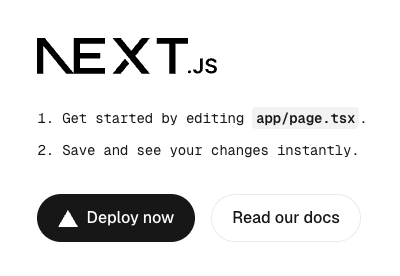

# Develop a front end using NextJS

This page is the first of two parts which explain how to develop a basic chatbot ui that will interact with a Forma agent, communicating via Streaming/SSE using the [Vercel AiSDK v5](https://ai-sdk.dev/docs/ai-sdk-ui/stream-protocol).

> Note: this part DOES NOT END with a functional chatbot. You need to complete part 2 for that.

We will use the following tech stack:

* [NextJS](https://nextjs.org/) as the framework
* [Tailwindcss](https://tailwindcss.com/) for styling
* [shadcn](https://ui.shadcn.com/) for making the components functional and pretty effortlesly
* [Vercel AiSDK v5](https://ai-sdk.dev/docs/ai-sdk-ui/stream-protocol) for processing the streamed responses


## Setting up your Forma AI Agent so respect this communication protocol

In order for our Forma agent to be compatible with this chatbot, we need to setup the runtime to use the `client` to `ai-sdk-v5`

```yaml
# runtime.yaml

persist_sessions: false # <-- Keep this for now
client: ai-sdk-v5 # <-- FOR AI_SDK COMPATIBILITY  
```

Also, remember to setup an API Key. Add this to the `.env` file in your Forma directory:

```sh
# .env, within the Forma agent directory
FORMA_AGENT_KEY=fake-key-which-should-be-longer-in-production
```


## Setting up our tech stach

THe first thing to do is to start a [NextJS](https://nextjs.org/) project. You do this by running the following command in your terminal

```sh
APP_NAME=nextjs-aisdk-5
npx create-next-app@latest --app --ts --tailwind --app --turbopack --yes $APP_NAME
cd $APP_NAME
```

That command created a new NextJS app, with TailwindCSS already in place. Now you can run

```sh
npm run dev
```

And go to [http://localhost:3000](http://localhost:3000) on your browser. You should see something like this:



All right, so this does not like a chatbot... but we will get there.


## Turn this into a chat

### Add support for the communication protocols

A chat needs messages, among other things. Let's install some libraries that will help us send and store messages

```sh
npm install ai '@ai-sdk/react'
```

### Cleanup the template

Remove all the stuff in the `public` folder within your project. You can do it using your mouse, or—if you use Mac or Linux—you can do this:

```sh
# If it asks you if you are sure... yeah, this should be safe.
rm ./public/*
```

### Add some useful UI components

This is a very simple template, and we might not need a whole library. However, as things scale, a library like [shadcn](https://ui.shadcn.com/) becomes very valuable. I guess their aesthetic appeal is always debatable. Regardless, my view is that they have **built-in functionalities that are quite pleasing for users** (e.g., close a dialog by pressing the 'Esc' key) and their style can be fully modified.

```sh
# It will ask you whether you want to install some dependencies, and 
# if you want to create a `components.json` file. Say Yes to both.
npx shadcn@latest add button
```

### Replace the landing page

There is a file in your project called `page.tsx` (located at `your-project-name/app/page.tsx`). Replace everything in it by copying and pasting the code below.

This code contains no Forma-specific code, and it is almost entirely just React/NextJS. **We will comment some specific bits of this code in the next section**.

```ts
// ./app/page.tsx
"use client"

import { Button } from "@/components/ui/button";
import { ArrowUpIcon, Sparkles } from "lucide-react"
import { useChat } from "@ai-sdk/react";
import { type UIMessage } from "@ai-sdk/react";
import { UIDataTypes, UITools, type UIMessagePart } from 'ai'
import { useCallback, useRef, useState } from "react";


type MessagePart = UIMessagePart<UIDataTypes, UITools>

type ChatRequestOptions = {
  headers?: Record<string, string> | Headers
  body?: object,
  data?: object
}

function Part({ part }: { part: MessagePart }) {
  switch (part.type) {
    case "text":
      return <p>{part.text}</p>
    default:
      console.log(`unsupported message part of type '${part.type}': ${JSON.stringify(part)}`)
      return null
  }
}


function SubmitForm({ sendMessage }: {
  sendMessage: (message: { text: string }, options?: ChatRequestOptions) => Promise<void>
}) {
  const [input, setInput] = useState<string>("")
  const textAreaRef = useRef<HTMLTextAreaElement>(null)
  const submit = useCallback(async (text: string) => {
    let area = textAreaRef.current
    if (area) {
      area.value = ""
    }
    sendMessage({ text })
  }, [])

  const onKey = useCallback((e: any) => {
    let newv = e.target.value.trim()
    setInput(newv)
    if (e.key === 'Enter') {
      submit(newv)
    }
  }, [setInput])

  return <div className='h-fit'>
    <div className='flex items-center p-2 rounded-2xl border m-1'>
      <textarea ref={textAreaRef} onKeyUp={onKey} className='flex-grow outline-none focus:outline-none resize-none' placeholder="Ask me anything!" />
      <Button size="icon" aria-label="Submit" onClick={() => {
        submit(input)
      }} >
        <ArrowUpIcon />
      </Button>
    </div>
  </div>
}

function Chatlog({ messages }: {
  messages: UIMessage[]
}) {
  return <div className="h-full flex-grow flex flex-col p-2 overflow-y-scroll">
    {messages.map((m) => {
      const parts = m.parts.map((p, i) => {
        return <Part key={i} part={p} />
      })
      switch (m.role) {
        case "assistant":
          return <div key={m.id} className='w-full flex'>
            <span><Sparkles /></span>
            <div className='bg-transparent text-foreground py-1 px-3 max-w-[70%] w-fit'>{parts}</div>
            <span className='flex-grow'></span>
          </div>

        case "user":
          return <div key={m.id} className='w-full flex'>
            <span className='flex-grow'></span>
            <div className='bg-primary text-primary-foreground rounded-md py-1 px-3 max-w-[70%] w-fit'>{parts}</div>
          </div>
        case "system":
          return null
        default:
          return <code>unsupported role {m.role}: {JSON.stringify(m)}</code>
      }
    })}
  </div>
}

export default function Home() {

  const {
    messages,
    sendMessage,
  } = useChat<UIMessage>({
    onError: (e) => {
      console.warn(e)
    }
  });

  return (
    <main className='flex flex-col h-screen w-full max-w-3xl mx-auto overflow-hidden'>      
      <Chatlog messages={messages} />
      <SubmitForm sendMessage={sendMessage} />
    </main>
  );
}

```

### Let's discuss this code a little bit

You might noticed that 93% if this code is just Typescript and NextJS/React. In fact there is 0% Forma-specific code, and just about 7% (8 lines) of AiSdk v5 code.

The code worth paying attention to is the following:

```ts
// This little piece of magic gives us two things
const {
  messages, // <-- (1) A list of messages to render
  sendMessage, // <-- (2) A function to send new messages
} = useChat<UIMessage>({
  onError: (e) => {
    console.warn(e) // <-- A bit of error handling here
  }
});
```

So, with those pieces in place, I can now just render the `messages` in any way I like, and I can call the `sendMessage` function to send messages.

Some things to know:
1. By default, `sendMessage` sends the messages to the `api/chat` endpoint. We will keep this default.
2. The list of `message`s is updated automatically as events are streamed from the back end.


## Setup the Back End

As mentioned earlier, `sendMessage` sends messages to `api/chat`, so we need to develop that. The path of every message will be the following:
1. You send a message from your browser (i.e., the Front end) 
2. The message is received by the `api/chat` endpoint (i.e., the Back End). It will add Authentication, and forward it to the Forma agent
3. The Forma agent processes the request, responding to the Back End
4. The Back-End pipes the messages to the Front-End.

We use this method because Forma agents are not meant to handle security (beyond an API Key). By calling forma agents from your back-end, you can:

1. Validate the users identity and permissions
2. Keep the Forma Agent API Key secure
3. Make the call to Forma agents a part of a longer process (e.g., updating a file in a bucket)
 
> **YOU ARE RESPONSIBLE FOR SECURING YOUR AGENT AND ADDING AUTHENTICATION**

So, add the code below to `app/api/chat/route.ts`. This path is the one the `useChat` function defines by default. 

```ts
// app/api/chat/route.ts

import { NextRequest, NextResponse } from "next/server";

export async function POST(request: NextRequest) {
    const body = await request.json() // Parse the front-end request
    try {
        // Send request to Forma Agent        
        const r = await fetch(`${process.env.FORMA_AGENT_URL!}/v1/chat`, {
            method: 'POST',
            headers: { 
                "Content-Type": "application/json",
                "Authorization": `Bearer ${process.env.FORMA_AGENT_KEY!}`
             },
            body: JSON.stringify(body),
            cache: 'no-store',
        });

        if (!r.ok) {
          // check if this was successful
          let error = await r.text()
          console.error(error)
          return new NextResponse(JSON.stringify({
              status: r.status,
              error
          }), { status: r.status });
        }

        // Pipe Forma's stream directly to client, 
        // adding the headers expected by the front-end
        const sseHeaders = {
            "x-vercel-ai-ui-message-stream": "v1",
            "Transfer-Encoding": "chunked",
            'Cache-Control': 'no-cache, no-transform',
            'Connection': 'keep-alive',
            'Content-Type': 'text/event-stream',
            "X-Accel-Buffering": "no"
        };
        
        return new NextResponse(r.body, {
            status: 200,
            headers: sseHeaders,
        });

    } catch (error) {
        console.error('Error proxying SSE stream:', error);
        return new NextResponse("Failed to connect to the streaming service.", { status: 500 });
    }
}
```

You also need to add the Environment variables we are referencing. Put them in your `.env` file:

```sh
# .env file of your Client

#  WHERE the agent is
FORMA_AGENT_URL=http://localhost:8080

# API Key. Should match the one you set on your Forma .env file
FORMA_AGENT_KEY=fake-key-which-should-be-longer-in-production 
```

### Run it

Now, open two terminal windows, and run the following:

```sh
# Run the Web App you just made
npm run dev
```

Talking to the Forma agent will fail, as—by default—Vercel sends all the messages in the conversation to the agent. Forma does not support that as of today. To to [the next section](./vercel-aisdk-5-persist.md) to continue.
