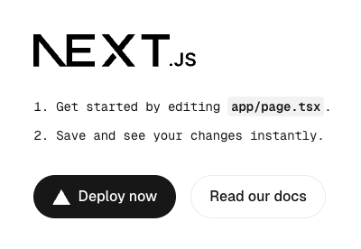

# Develop a front end using NextJS

This project is about developing a basic chatbot ui that will interact with a Forma agent, communicating via Streaming using the [Vercel AiSDK v5](https://ai-sdk.dev/docs/ai-sdk-ui/stream-protocol).


We will use the following tech stack:

* [NextJS](https://nextjs.org/) as the framework
* [Tailwindcss](https://tailwindcss.com/) for styling
* [shadcn](https://ui.shadcn.com/) for making the components functional and pretty effortlesly
* [Vercel AiSDK v5](https://ai-sdk.dev/docs/ai-sdk-ui/stream-protocol) for processing the streamed responses


## Setting up our tech stach

THe first thing to do is to start a [NextJS](https://nextjs.org/) project. You do this by running the following command in your terminal

```sh
APP_NAME=nextjs-aisdk-5
npx create-next-app@latest --app --ts --tailwind --app --turbopack --yes $APP_NAME
cd $APP_NAME
```

That command created a new NextJS app, with TailwindCSS already in place. We also need to install the libraries that will help us with the streaming protocols:

```sh
npm install "@ai-sdk/react"
```

> **Note** - The ShadCN components are added in a different manner... we will get there.

Now you can run

```sh
npm run dev
```

And go to [http://localhost:3000](http://localhost:3000) on your browser. You should see something like this:



All right, so this does not like a chatbot... but we will get there.


## Let's add the required communication protocols

```sh
npm install ai '@ai-sdk/react'
```

## Turn this into a chatbot-like UI


### Cleanup the template

Remove all the NextJS and Vercel branding. It is located in the `public` folder within your project. 

If you use Mac or Linux:

```sh
# If it asks you if you are sure... yeah, this should be safe.
rm ./public/*
```

### Add some useful components

Honestly, this is a very simple template and we might not need them... but as things scale, it becomes necessary to add some [shadcn](https://ui.shadcn.com/) components. While it is debatable whether they look appealing out of the box, they have built-in functionalities that are quite pleasing for users (e.g., close a dialog by pressing the 'Esc' key) and their style can be fully modified.

```sh
# It will ask you whether you want to install some dependencies, and 
# if you want to create a `components.json` file. Say Yes to both.
npx shadcn@latest add button
```

### Replace the landing page

There is a file in your project called `page.tsx` (located at `your-project-name/app/page.tsx`). Replace everything in it by copying and pasting the code below.

This code contains no Forma-specific code, and it is almost entirely just React/NextJS. **We will comment some specific bits of this code in the next section**.

```ts
// ./app/page.tsx
"use client"

import { Button } from "@/components/ui/button";
import { ArrowUpIcon, Sparkles } from "lucide-react"
import { useChat } from "@ai-sdk/react";
import { type UIMessage } from "@ai-sdk/react";
import { UIDataTypes, UITools, type UIMessagePart } from 'ai'
import { useCallback, useRef, useState } from "react";


type MessagePart = UIMessagePart<UIDataTypes, UITools>

type ChatRequestOptions = {
  headers: Record<string, string> | Headers
  body: object,
  data: object
}

function Part({ part }: { part: MessagePart }) {
  switch (part.type) {
    case "text":
      return <p>{part.text}</p>
    default:
      console.log(`unsupported message part of type '${part.type}': ${JSON.stringify(part)}`)
      return null
  }
}


function SubmitForm({ sendMessage }: {
  sendMessage: (message: { text: string }, options?: ChatRequestOptions) => Promise<void>
}) {
  const [input, setInput] = useState<string>("")
  const textAreaRef = useRef<HTMLTextAreaElement>(null)
  const submit = useCallback(async (text: string) => {
    let area = textAreaRef.current
    if (area) {
      area.value = ""
    }
    sendMessage({ text })
  }, [])

  const onKey = useCallback((e: any) => {
    let newv = e.target.value.trim()
    setInput(newv)
    if (e.key === 'Enter') {
      submit(newv)
    }
  }, [setInput])

  return <div className='h-fit'>
    <div className='flex items-center p-2 rounded-2xl border m-1'>
      <textarea ref={textAreaRef} onKeyUp={onKey} className='flex-grow outline-none focus:outline-none resize-none' placeholder="Ask me anything!" />
      <Button size="icon" aria-label="Submit" onClick={() => {
        submit(input)
      }} >
        <ArrowUpIcon />
      </Button>
    </div>
  </div>
}

function Chatlog({ messages }: {
  messages: UIMessage[]
}) {
  return <div className="h-full flex-grow flex flex-col p-2 overflow-y-scroll">
    {messages.map((m) => {
      const parts = m.parts.map((p, i) => {
        return <Part key={i} part={p} />
      })
      switch (m.role) {
        case "assistant":
          return <div key={m.id} className='w-full flex'>
            <span><Sparkles /></span>
            <div className='bg-transparent text-foreground py-1 px-3 max-w-[70%] w-fit'>{parts}</div>
            <span className='flex-grow'></span>
          </div>

        case "user":
          return <div key={m.id} className='w-full flex'>
            <span className='flex-grow'></span>
            <div className='bg-primary text-primary-foreground rounded-md py-1 px-3 max-w-[70%] w-fit'>{parts}</div>
          </div>
        case "system":
          return null
        default:
          return <code>unsupported role {m.role}: {JSON.stringify(m)}</code>
      }
    })}
  </div>
}

export default function Home() {

  const {
    messages,
    sendMessage,
  } = useChat<UIMessage>({
    onError: (e) => {
      console.warn(e)
    }
  });

  return (
    <main className='flex flex-col h-screen w-full max-w-3xl mx-auto overflow-hidden'>      
      <Chatlog messages={messages} />
      <SubmitForm sendMessage={sendMessage} />
    </main>
  );
}

```

## Setup the Back End

Yes, so what will happen here is that your browser (i.e., Front end) will send a request to your back end (the code below) which will forward the request to the Forma agent. 

> **Note** - The reason to implement it like this is for you to add authentication, security and all sorts of measures you think are needed. **WE STRONGLY ENCOURAGE YOU ADD AUTHENTICATION**

So, add the code below to `app/api/chat/route.ts`. This path is the one the `useChat` function defines by default. You can change it but there is no need at the moment.

```ts
// app/api/chat/route.ts

import { NextRequest, NextResponse } from "next/server";
import { baseFormaUrl } from "../rest_utils";


export async function POST(request: NextRequest) {
    const body = await request.json() // Parse the front-end request
    try {
        // Send request to Forma Agent        
        const r = await fetch(`${baseFormaUrl()}/v1/chat`, {
            method: 'POST',
            headers: { "Content-Type": "application/json" },
            body: JSON.stringify(body),
            cache: 'no-store',
        });

        if (!r.ok) {
          // check if this was successful
          let error = await r.text()
          console.error(error)
          return new NextResponse(JSON.stringify({
              status: r.status,
              error
          }), { status: r.status });
        }

        // Pipe Forma's stream directly to client, 
        // adding the headers expected by the front-end
        const sseHeaders = {
            "x-vercel-ai-ui-message-stream": "v1",
            "Transfer-Encoding": "chunked",
            'Cache-Control': 'no-cache, no-transform',
            'Connection': 'keep-alive',
            'Content-Type': 'text/event-stream',
            "X-Accel-Buffering": "no"
        };
        
        return new NextResponse(r.body, {
            status: 200,
            headers: sseHeaders,
        });

    } catch (error) {
        console.error('Error proxying SSE stream:', error);
        return new NextResponse("Failed to connect to the streaming service.", { status: 500 });
    }
}
```

## Configure your Forma AI Agent so respect this communication protocol

In order for our Forma agent to be compatible with this chatbot, we need to set the `client.flavor` to `ai-sdk-v5`

```yaml
persist_sessions: false # <-- KEY, UNTIL WE IMPLEMENT CONTEXTUAL MEMORY
client: 
  flavor: ai-sdk-v5 # <-- KEY FOR AI_SDK COMPATIBILITY
start:
  nodes:
    - llm:
        provider: ollama        
      system_prompt: 'you are a helpful assistant'
```

### Run it

Now, open two terminal windows, and run these two:

```sh
# Go to wherever your forma agent is
cd <forma/path>
# The Forma CLI
forma serve
```

```sh
# Run the Web App you just made
npm run dev
```