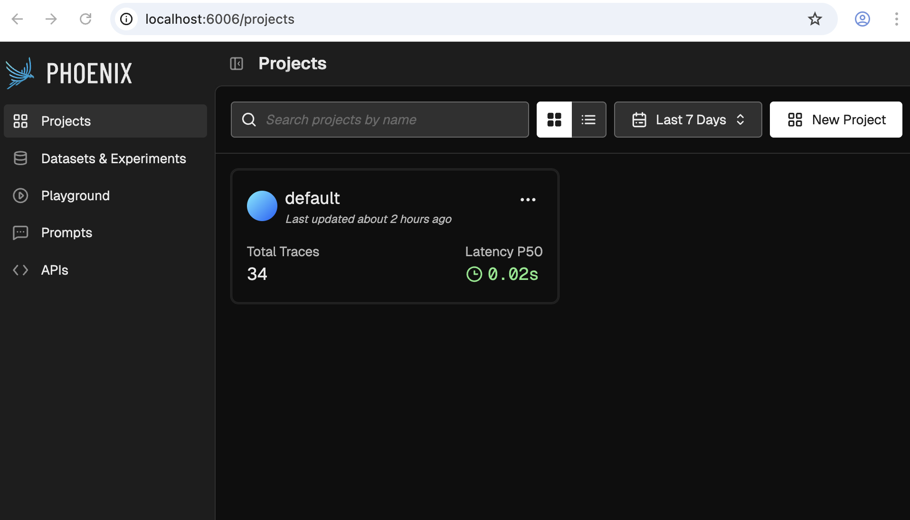
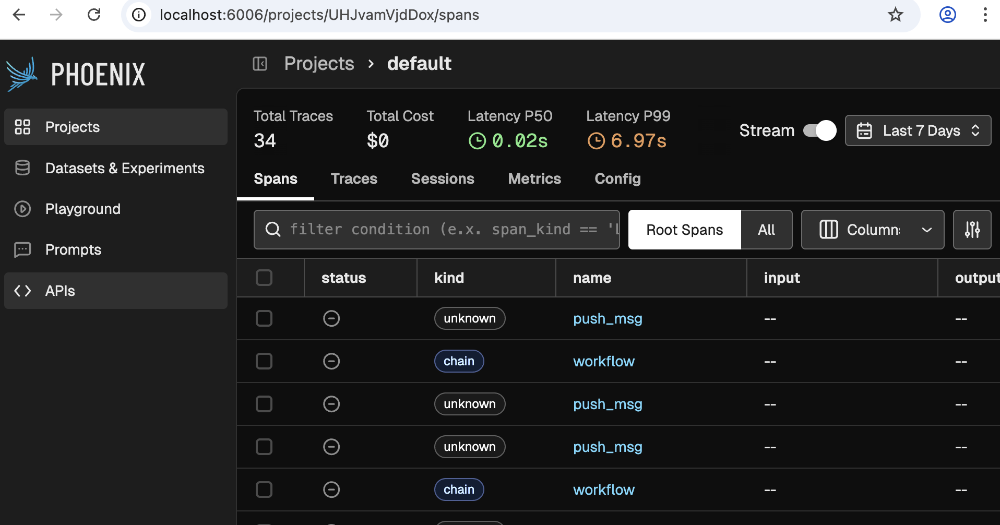
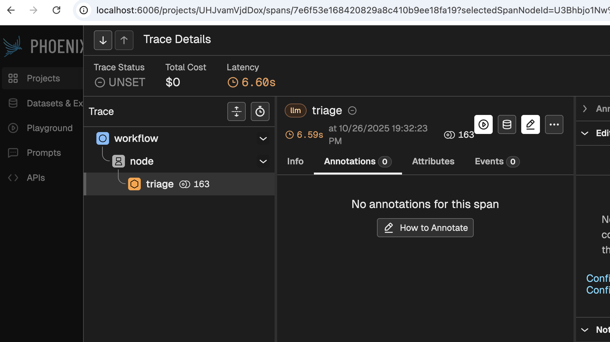

# Observability - Understanding how Forma agents process requests

At the moment, Dory is very simple: you send a message, it sends it to an LLM, and then it returns the answer. But it should not stay that way. In the next section we will start adding tools and workflows, which will let Dory process more sophisticated and complex tasks. This surfaces some challenges. 

When AI Agents become more sophisticated, the trajectory of a request is no longer simple or necessarily predictable. Did Dory search for documents? or it answered just using its built-in knowledge? If we see an incorrect answer, how can we know what to fix? Where in the process did Dory make a mistake?

The answer to this is Observability: the ability to undertand a system's internal state by analyzing logs, traces and metrics. In other words, every time a Forma agent processes a request, it emits a bunch of information about what happened. This information is not meant to be read by the user, but by you; and the purpose is that you understand why answers are the way they are, and fix what needs to be fixed.

## 1. Start the Observability service

Just like with memory, Forma will not keep the logs itself. It sill send them "somewhere"; in this case, a service called [Arize Phoenix](https://phoenix.arize.com/). While in production you do not have to use it, it has proved to be easy to set up and quite powerful for what we need at the moment.

This service is also configured at the `./dev/dev-services.yaml` file, which you will run using:

```sh
# You need to have docker-compose installed
docker-compose -f ./dev/dev-services.yaml up
```

>❗**Important**: Depending on whether you stopped the services earlier or not, this might already be running.

## 2. Go to Phoenix's UI

As documented on the `dev-services.yaml` file, when you run it, Phoenix's UI will be available at [http://localhost:6006](http://localhost:6006). It should look something like the following:



## 3. Talk to your agent

Follow the same steps you followed in [the first tutorial](./dory.md#3-chat-with-your-agent) to chat with your agent and generate some traces.

```sh
forma chat
```

## 4. Check some *traces*

We will use Phoenix for other things as well, but for now lets focus on Traces. For this, click on the one and only project available. You should see something like this:



>❗**Note**: If you do not see any traces, then you need to talk to your agent a bit more, or wait for a minute.

Now click on any of the rows that say 'workflow', and you will see something like the following come up:



Even before clicking any buttons, this screen reveals a bit of its power. This simple image tells you is that:

1. A workflow received the request, and handed it over to a node
2. The node 'Triaged' the request.
3. 163 tokens were used
4. It took 6.6 seconds to process the request

Digging deeper would provide you with much more and valuable information, such as:

1. What model was used for each stage
2. What was the system prompt used 
3. Which agent made the call (useful for when you have multiple agents deployed)
4. Which user and session does the message correspond to
5. Which node processed each thing
6. How much of the 6.6 seconds were spent on each step of the process
7. Why did the model stop anseering (did it finish? did it reach a limit? was the response flagged as offensive?)
8. etc.
