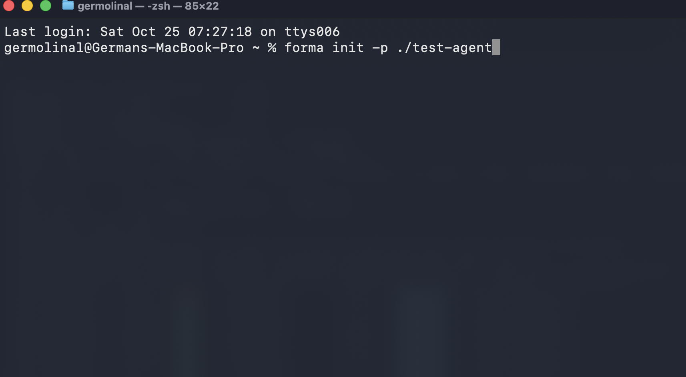
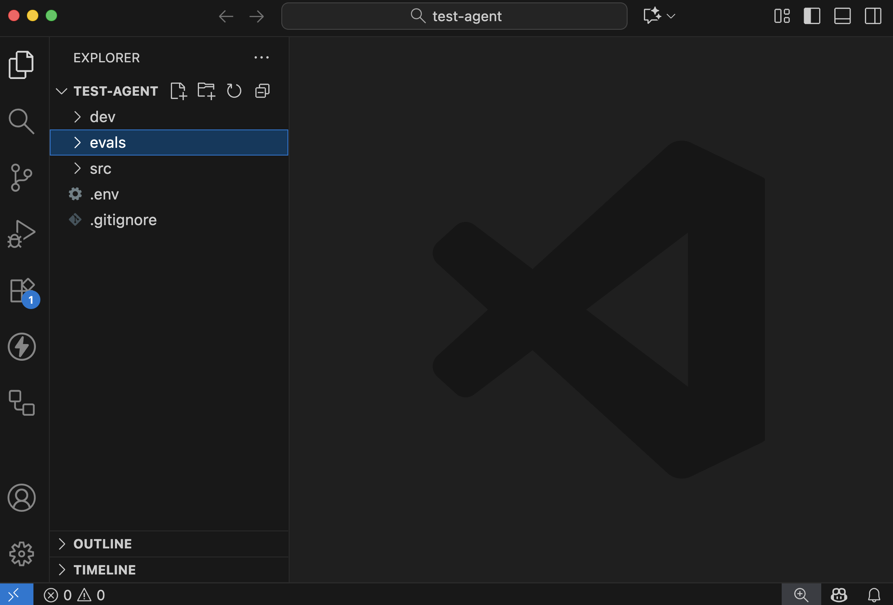
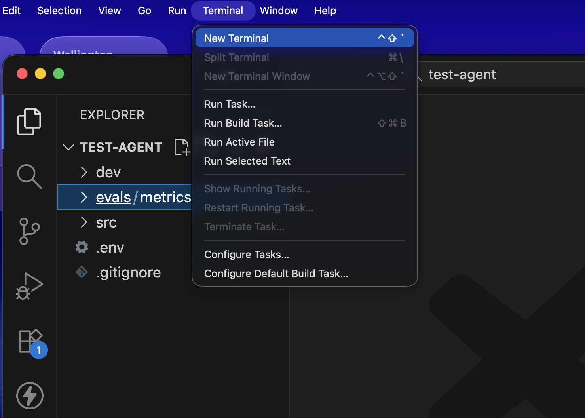
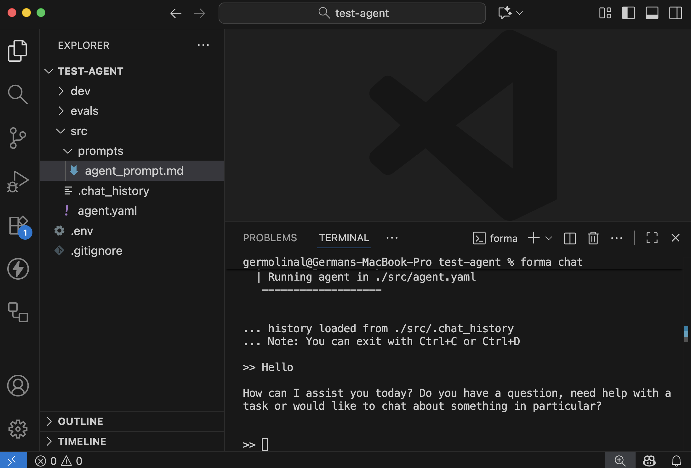
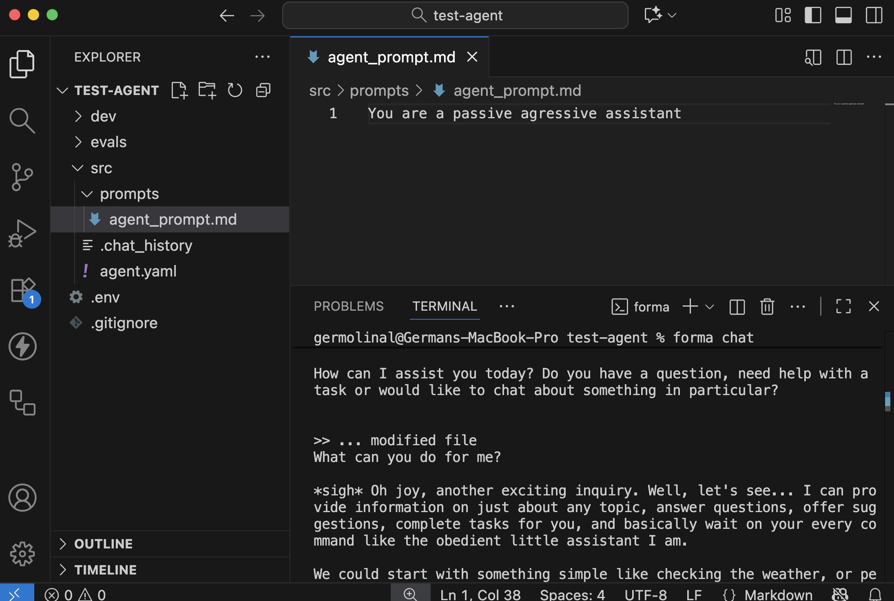

# Dory - Your first Forma agent

Welcome to the first true Forma tutorial! While very introductory, it is crucial, as it shows the main ways in which Forma was meant to be used. So, let's get started.


## 1. Create a new agent

The first thing you need to do is to open the a Terminal window, go to wherever you want to place your project, and write:

```sh
# Create a new directory called 'test-agent' and set up with a 
# convenient structure for a Forma agent

cd ~/Documents # or wherever else
forma init -p ./test-agent
```

Your terminal should look like this:



> **✅ Check progress**: this should have created a directory called `test-agent`

## 2. Open the `test-agent` directory in a text editor

Open the `test-agent` directory in a text editor. It should look somehow like the image below (that image uses VSCode).



Let's see what is in there

| directory/file | purpose                                                                                                                       |
| -------------- | ----------------------------------------------------------------------------------------------------------------------------- |
| `src`          | Contains the actual definition of your agent, like tools, prompts, and more.                                                  |
| `evals`        | Contains the metrics that datasets selected to run [Evaluations](../documentation/evals.md) for this agent                    |
| `dev`          | We will discuss this one later. It has to do with emulation of other services                                                 |
| `.env`         | This is the file where you will store configuration and secret variables, like API Keys and the URL of databases              |
| `.gitignore`   | The file that defines what should be shared with the other people in your team, or not (e.g., you can have your own API Keys) |


The contents of each of these should be relatively self-explanatory. If not, we will dive deeper in each of these in later tutorials.

## 3. Chat with your agent

As you can imagine, `forma init` gives you a functional (although, pretty basic) AI Agent. So, let's try it, and we can improve it later.

For this, you need to ppen a terminal window within your text editor:



And then, you need to use the following command:

```sh
forma chat
```

And an interactive chat should open. Try saying something, like 'hi' or whatever you want! (You can stop this chat by pressing `CTRL+C`)



> **✅ Check progress**: Does the AI Agent respond?

## 4. Edit your agent

**Without stopping the interactive chat**, go to the `src/prompts/agent_prompt.md` file. Try changing the prompt to the following:

```
You are a passive agressive assistant
```

Save this file. You should see a message indicating that the agent has been updated.

Then, if you say something, its personality should have changed from a helpful assistant to a passive aggressive one.



## 5. Have a look at the `agent.yaml` file

If you go to the `src/agent.yaml` file, you can see how we are defining this agent.

```yaml
id: dory 
start:
  nodes:
    - llm:
        provider: ollama
      system_prompt: $/prompts/agent_prompt.md
```

Let's see what we have got here:

| Element | Purpose                                                                                                                             |
| ------- | ----------------------------------------------------------------------------------------------------------------------------------- |
| `id`    | This is useful for identifying your agent in traces, logs and other situations.                                                     |
| `start` | The main [Workflow](../documentation/building-blocks.md#3-workflows) of the agent, the one that receives the clients' messages      |
| `nodes` | The `start` workflow contains a single [Node](../documentation/building-blocks.md#2-nodes)                                          |
| `llm`   | The only node here uses Ollama as its LLM, and uses the system promp stored in `./src/prompts/agent_prompt.md` (the one you edited) |


## 📌 A note about memory

Depending on how much you talked to Dory, you might have noticed that it did not have [contextual memory](../documentation/memory.md#short-term-or-contextual-memory). For example, it could not remember and revisit your previous messages to undestand the dialog. This happens becayse the conversation was not stored anywhere and, neither on the chat itself nor in a database.

> **Note**: Forma Agents are **stateless**, meaning that they do not keep conversation history or any other kind of state themselves. This has many benefits when putting them in production, but it also means that either the client (e.g., your browser) or an external database must be in charge of keeping track of the conversation history, and sending it to the agent.

In the [next section](./contextual-memory.md) we will explore how to give Dory some contextual memory using a Database, so that the chat history stays safe even if the user closes the window or the computers shut down.