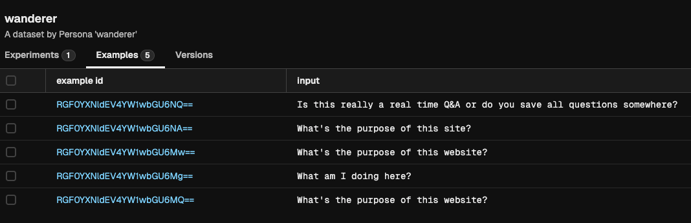
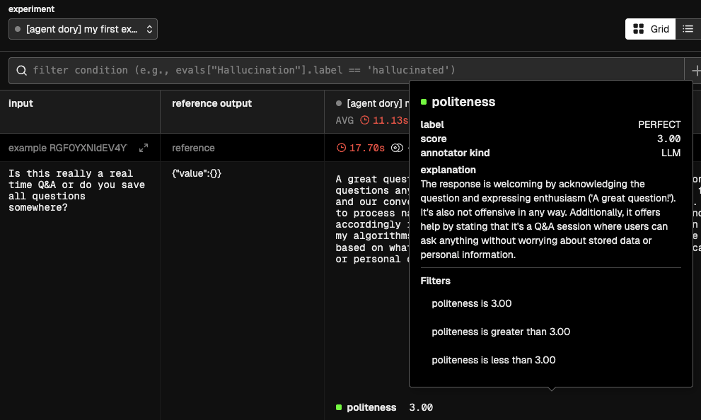

# Offline Evaluations


As you might have read in the [Evaluations explanation](../documentation/evals.md), evaluations are fundamental for developing trustworthy and reliable AI Agents. Forma encourages people to run evaluations often. This tutorial aims to explain the workflow that Forma has envisioned for Evaluations.

In simple terms, an evaluation is a straightforward concept:

1. You have a sample question
2. You ask that question to your agent
3. You then use some metric or rubric to decide whether the answer is good enough or not, and why (this will sometimes require having a sample output)

Forma can help us with these three steps.

> **Note**: *Offline* evaluations refer to the evaluations **run before** deploying an AI Agent. They are different from *online* or *continuous* evaluation in that they can use pre-established datasets to compare actual vs expected answers. Continuous evaluation is still in development.

## 1. Use *Personas* to generate sample questions

For our current goal, *Persona* is no more than a roleplaying LLM. We tell an LLM "Pretend to be...", and they will send messages as if this was the case. We can leverage this for generating sample data.

AI Agents can be surprisingly good testers of other AI Agents as many of their flaws—like hallucinations and potential offensiveness—are not an issue when generating data. After all, users are allowed to be way more offensive and clueless than an AI Agent (because if the user does not understand quickly what the App is about, we blame the designer, not the user).

So, let's explore our first *Persona*. Open the file `./evals/personas/wanderer.yaml`

```yaml
llm:
  provider: ollama
prompt: You are a person who just landed on a
  website, and this website is just a chatbot. It is an
  empty canvas with a textbar saying "ask me anything"
  and a send button. When you get any message, just 
  respond with what you would ask.
```

As you can tell, we are asking an LLM (ran by Ollama, in this case) to pretend to be a human who just happens to have landed in front of a Chatbot. What would your first reaction be?

So, we can generate some sample data by running:

```sh
forma tester -f wanderer.yaml -n 5
```

You will notice that the `wanderer.json` file contains a list of objects which only have an `input` field. Each of these examples *can* also contain an `expected_output` field, which may be used for contrasting them with the responses from your agent.

## 2. Upload the dataset to Arize Phoenix

You are probably familiar by now with the fact that Forma depends on other services to operate properly. The same service we used in the [previous tutorial](./dory-traces.md)—called [Arize Phoenix](https://arize.com/docs/phoenix)—helps us manage our datasets and also visualise results in order to know whether our changes have improved the agent or not.

So, let's get that service running (if you haven't already)

```sh
# You need to have docker-compose installed
docker-compose -f ./dev/dev-services.yaml up
```

And then upload the dataset we just created to it.

```sh
forma dataset-upload -f ./evals/data/wanderer.json
```

If you now go to the Phoenix Service (in [http://localhost:6006/](http://localhost:6006/)), you should see your dataset:



## 3. Test your agent with that dataset

Before using our `wanderer` dataset for running evaluations, we need to define this evaluation. We can define evaluations in different [sub-components of the agent](../documentation/building-blocks.md) of the agent in order to perform more focused assessments.

In this case, we will evaluate the agent itself. This comes out of the box when you run `forma init`.

```yaml
# Define evaluations down here
evals:
  - dataset: wanderer
    metrics:
      - template: $../evals/metrics/politeness.md
        llm:
          provider: ollama
```

You can go and check the `politeness.md` file, and you will notice that it uses the same templating system we were using earlier (see [below](#what-is-happening-under-the-hood) to learn about the valid fields for evaluation templates).

With this in place, we can now run:

```sh
forma eval -e "my first experiment"
```

If you now go to the Phoenix Service (in [http://localhost:6006/](http://localhost:6006/)), you should see the results of the evaluation, including the metrics:



# ❓What is happening under the hood?

1. The first step is to ask your Agent, Node or Workflow that will be evaluated to produce an answer. This is called the `actual_output`.
2. Having generated the `actual_output`, the metric template will be rendered. This template can contain only three fields:   
   * `actual_output` - Which will be replaced with the answer of the agent, node or other.
   * `input` - Which will be replaced by the input, extracted from the dataset.
   * `expected_output` - An optional value, that would also be extracted from the example.
3. This new rendered template will be sent to an LLM of your choice, which will be asked to generate:
   * `label` - A single-word verbal equivalent of the score (e.g., 'Good', 'Bad', 'Hallucination'). Base this value on the instructions provided
   * `score` - The numerical value reflecting the quality of the evaluation, assigned as per the instructions
   * `explanation` - A verbal explanation for the score and labels given