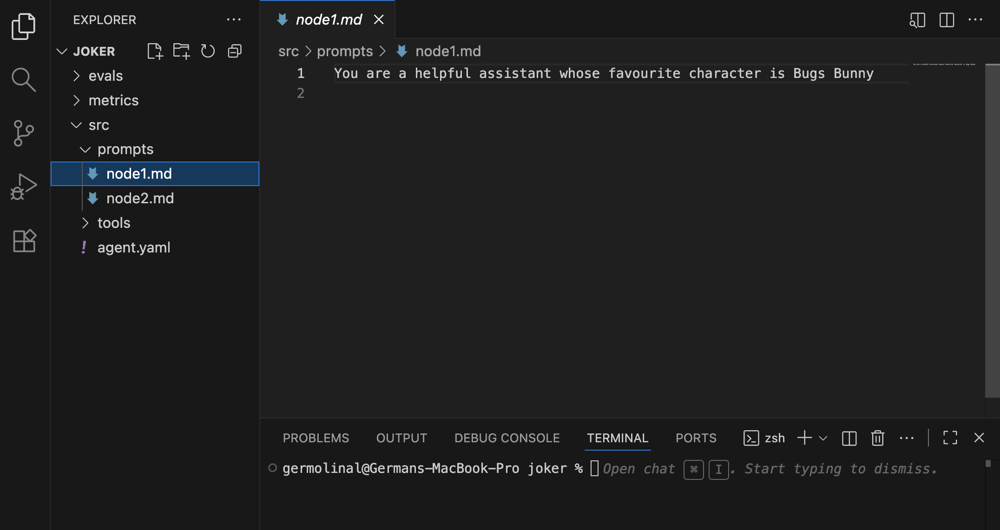

# Getting started

Before getting started with Forma, you need to remember that, as mentioned in the [introduction](../documentation/intro.md#2-architected-for-your-existing-cloud-infrastructure), Forma is not a platform. It is a framework for you to build reliable AI Agents and add them to your cloud infrastructure, and **it does not come with the batteries included**. This is a deliberate choice which, even if it makes it hard to get started, makes it far easier to integrate into real cloud infrastructure.

So, in order to use it, you will need:

1. **The Forma CLI** - Necessary to run, test, deploy AI Agents
2. **A Code or Text editor** - Necessary to define the AI Agents
3. **Docker (or similar)** - To run services like databases, observability platforms, etc.
4. **`git`** - For managing different versions and changes in an auditable and secure manner.

## Describing Forma AI Agents

Forma agents are fully described using text files and, therefore, it is only natural that **your main development tool will be a code/text editor**. The advantage of a good code/text editor is that it will give you (unsurprisingly) excellent text editing capabilities, and good integration with tools like [version control](https://en.wikipedia.org/wiki/Version_control) and the Forma CLI. Additionally, a good editor will be able to highlight the syntax of the different file formats we will be using (`yaml`, `markdown`, `json`).

> **Note** - If you aren't sure what code editor to choose, [VS Code](https://code.visualstudio.com/) might be a good fit. If you have strong opinions about this—and many people do—use whatever suits you.

## Running and testing Forma AI Agents

The Forma CLI is the main tool you will use during development. Among other things, it will help you:

* **Start** new projects (`forma init`)
* **Run a development server** for testing and prototyping (`forma serve`)
* **Evaluat your agent** to ensure quality and guide your prompting (`forma eval`)

Read more details on the [how to define your first agent](./define-a-new-agent.md) section.

## Deploying a Forma AI Agent

This is still being designed, but the main goal is to deploy agents using DevOps and CI/CD pipelines.

> **TODO**