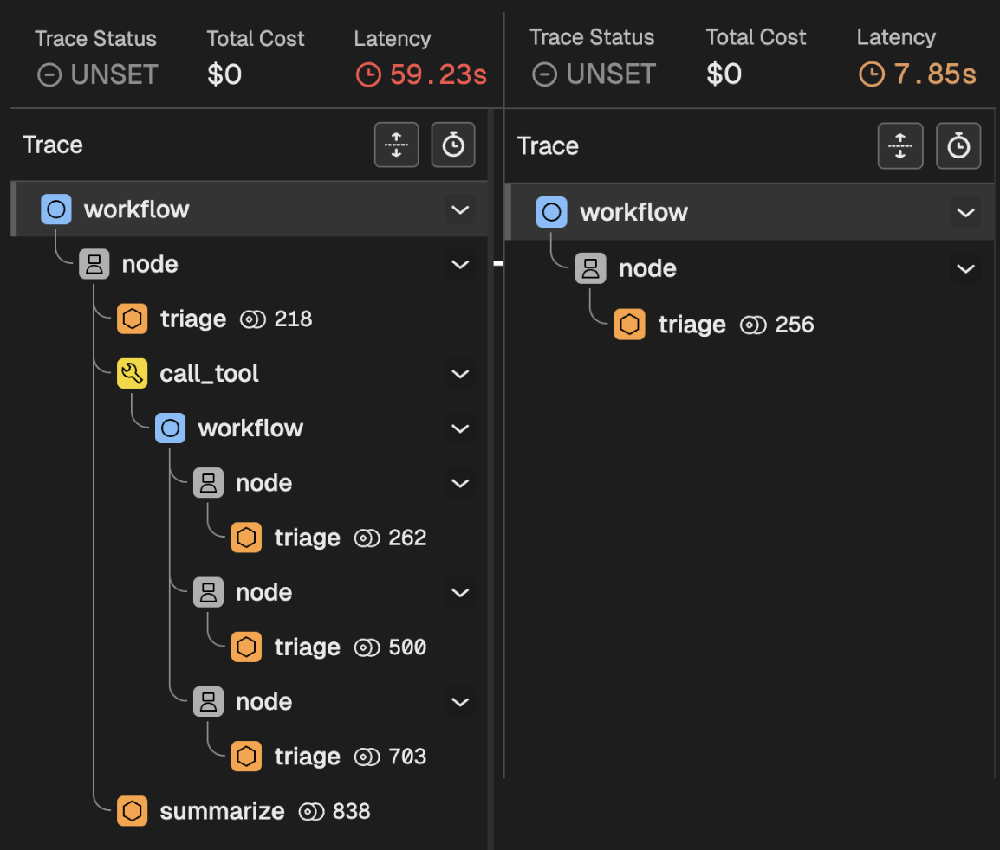

# Introduction to Tools

Tools are the instruments that **allow an AI Agent to *do* things**, rather than just *read and write* text. By giving an Agent access to tools, you effectively transform it into a user interface. You can now use natural language to send emails, check the time, read a database and summarise the results, and much more. Depending on how you design your agent, you might want to give it permissions to do things without you asking (e.g., as a reaction to specific pictures being uploaded).

Before jumping into a hands-on tutorial, you need to remember the following concepts:

1. A **tool is just a normal programming function** that receives certain arguments, and returns a value.
2. **LLMs *cannot* call tools**, they can only decide *which* function should be called, and *what* the arguments should be. This means that we can add additional safeguards before calling a tool (e.g., role-based permissions)
3. The decision to call a tool is based on both its **name and description**. We need to give LLMs this information so that they decide when and if a tool should be used.
4. **LLMs do not know what happens within the tools**, and they do not need to. If a model chooses to use the `get_product_description` tool, that function could talk to another agent, fetch information from a database, or even return some mock/fake data. The LLM only needs to know what the tool achieves, not how.
5. **Calling tools is optional**, meaning that there is no guarantee that a specific tool will be ran (this is the opposite of the case of Worlfkows, where all nodes are guaranteed to run)

## Tools in Forma

By design, Forma does not let you define arbitrary functions directly as tools. Instead, it exposes **built-in connectors** that act as bridges to your actual logic. For instance, you can use an `open-api-tool` to make HTTP requests to any endpoint. This is perfect for connecting to your own APIs, cloud functions, or serverles actions.

As mentioned earlier, an LLM needs three piecs of information to decide when and how to use a tool:

1. `name` - The name of the tool
2. `description` - A description of the tool
3. `tool` - The tool itself, which will require:
   1. `type` - the Type of tool (there is a finite number of tool types)
   2. ... Other arguments specific to the tool.

Within the tool itself, Forma always requires `type`, which lets it know which specific tool you are defining.


## Tutorial time - Let's define our first tool

So far, our version of Dory ([from the workflows tutorial](./workflows.md)) can only do one thing: It receives a research topic, and produces a blog post in Spanish. But we know Dory can do more! So let's **turn this functionality into a tool** and give Dory the *choice* to use it or now. 

We use a `workflow` tool for this. A `workflow` tool executes a workflow just like before, except that it does not receive the conversation context. Its output depends exclusively on the arguments passed to it. 

But, if it does not receive the users' messages, what does the `workflow` tool respond to? Well, it receives a single message with **whatever you define in the `input_prompt` field**. This will become clearer once you follow the tutorial and then check the traces and logs.

### 1. Place the main workflow into its own file

While you could just extend our `agent.yaml` file, it will easily become hard to read. Let's avoid this by creating a file called `./src/tools/generate_blog_post.yaml`. In this file we will pass the information we mentioned earlier: name and description of the tool, and the tool itself.

```yaml 
# ./src/tools/generate_blog_post.yaml
name: write-blog-post 
description: writes great blog posts about research topics that the user wants, in Spanish
tool:  
   # Specify the tool and the arguments
  type: workflow 
  input_prompt: write a blog post about '{{research_topic:string "the research topic chosen by the user"}}.'
  ## From here and on, this is the exact same workflow we had before
  output: translation
  nodes:
    - id: study-summary
      llm:
        provider: ollama
      system_prompt: $/prompts/summarizer.md

    - id: blog-post
      llm:
        provider: ollama
      system_prompt: $/prompts/blogger.md

    - id: translation
      llm:
        provider: ollama
      system_prompt: $/prompts/translator.md
```

As you can see, this file contains almost the exact same workflow we had before, with the addition of two fields:

1. `type` - This indicates to Forma what kind of tool you are defining. The LLMs are not aware of this field and do not use it.
2. `input_prompt` - This specifies the message that this workflow will receive. It uses the [Template syntax](./templates.md) explained earlier.

> **💡 Example**: In this case, if the LLM decides to call this tool using the research topic *"gravity in the star wars universe"*, the message that this workflow will receive (and respond to) will be *"write a blog post about 'gravity in the star wars universe'."*


### 2. Register the tool with Dory

We will go back to our simplest Dory (although, with memory), and we will add a tool to its node.

```yaml
id: dory
persist_sessions: true
start:
  nodes:
    - llm:
        provider: ollama
      system_prompt: You are a helpful assistant
      tools: # <-- Tools to the Node (not workflow, agent, or llm)
        - $/tools/generate_blog_post.yaml # <- Point to our newly created file        
```

With this, Dory no longer *has* to produce a blog post every time. It can now *choose* to use this tool when appropriate.

### 3. Run it and check the traces

Chat to Dory! First greet it, then ask for a research blog post. You should notice two completely different behaviors (as reflected in the image below, showing the traces). 



#### When you greet Dory

When you greet Dory:

1. Your message enters the main workflow
2. The message reaches the first and only node
3. Nodes are predictable: They first Triage calling an LLM, who whether whether to call a tool.
4. The LLM decided *not* to call a tool, and just respond quickly.

#### When you ask for a research blog post

When you ask for a blog post:

1. Your message enters the main workflow
2. The message reaches the first and only node
3. The node Triages making a request to the LLM.
4. The LLM decides to call the Workflow tool, which means:
   1. Your message enters the workflow of the tool
   2. The three internal nodes are executed
   3. The output is returned to Dory
5. Dory takes the result of the Workflow tool, and writes a response to you

## Conclusion

What you are seeing here is a key element of sophisticated AI Agents in Forma. While woorkflows let you break down big tasks into several smaller and more focused ones, tools let AI Agents decide what to do. On top of letting agents interact with external systems, tools are also routers that Agents can use to process requests in completely different ways depending on the input and its instruction. 


# Available tools

Check the list of tools in the [Reference Documentation](../reference_docs/auto-toolrunner.md).
