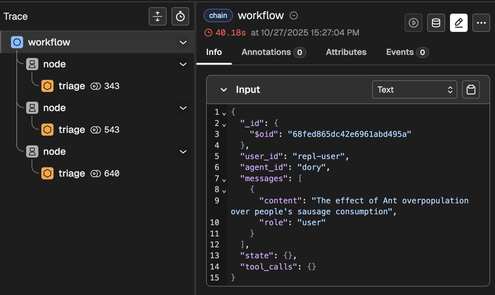
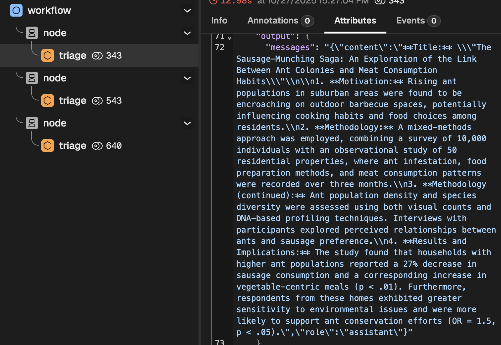
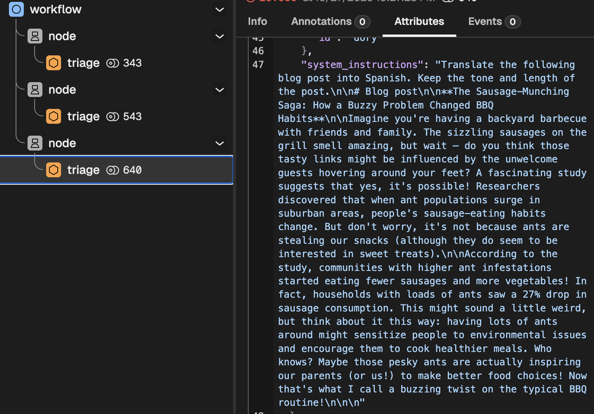

# Workflows

As it was explained earlier, [workflows](../documentation/building-blocks.md#3-workflows) are a mechanism to break down large tasks into smaller ones. The value of this is that our system instructions will be shorter and more focused, meaning that LLMs will behave in a more predictable manner. Let's revisit the original example: 

> **Example**
> 
> We can break down this: 
> 
> ```
> Take this academic article and produce a blog post for 5th-graders, 
> in Spanish. 
>
> The content of the blog post should include a brief 
> introduction/motivation, a brief explanation of the methodology,
> and an emphasis in the results and implications.
>  
> Your target audience is 5th graders, so do not use acronyms or jargon.
> Use examples to make it more relatable.
> ```
> 
> Into these more focused steps
> 
> 1. `Create a list containing the (1) motivation; (2) methodology; (3) results and implications from the following paper` 
> 2. `Write a blog post for 5th graders based on the following summary points. Explain the motivation, outline the methodology and emphasise the results and implications. Use examples to make it more relatable.` 
> 3. `Translate this blog post into Spanish. Keep the tone and length of the post.`

I guess the motivation is clear enough. Let's get started.

## 1. Let's create a workflow

A workflow is a series of nodes that might or might not depend on each other. The way to express dependency is through Templates. This means that the system prompt of one node can reference another node (using its ID), indicating two things that the output of the referenced node should be injected into the system prompt if this node.

It will become clearer with an example.

### Step 1 - Summarize (or make up) an article

For the sake of an example, instead of asking an LLM to summarize an article, let's ask it to invent one. Create a file called `src/prompts/summarizer.md`, which will contain the instructions for making up a study summary.

```md
You are an expert con artist. Your job is to take any topic the 
user gives you, and pretend that you performed a study about that 
topic. You should respond by stating:

1. A title for the published reports
2. The motivation for the study
3. The methodology
4. And the results and implications

You should respond with just that information, without adding 
ANY comments such as "here is the study".

Be brief.
```

Now we need to update Dory so that it uses this prompt.

```yaml
id: dory
persist_sessions: true 
start:
  nodes:
    - id: study-summary # We need to assign an ID
      llm:
        provider: ollama
      # You can delete the original "agent_prompt.md" file, if you want
      system_prompt: $/prompts/summarizer.md 
```

So far, nothing much has changed. You have the same Dory but with different instructions. You can talk to Dory and it will do as we instructed.

> **📌 Note**: We need to assign an ID, which we will use to reference the output of this node in subsequent steps.

### Step 2 - Write a blog

Create a file called `src/prompts/blogger.md`, which will contain the instructions for the new node, in charge of writing blog posts.

```md
Write a blog post for 5th graders based on the study summarized below.

Explain the motivation, outline the methodology and emphasise the results 
and implications. Use examples to make it more relatable.

Keep it brief, aim for 2 paragraphs.


# Study

{{study-summary}}

```

> **📌 Note**: Forma will replace the `{{study-summary}}` field by the output of the node whose id is `study-summary`.

Now we need to update Dory so that it uses this prompt.

```yaml
id: dory
persist_sessions: true 
start:
  # Because we have multiple nodes, we need to 
  # specify which one is the output. Multiple values
  # are also alloed
  output: blog-post # <-- Update this 
  nodes:
    - id: study-summary
      llm:
        provider: ollama
      system_prompt: $/prompts/summarizer.md

    # Add the new step
    - id: blog-post
      llm:
        provider: ollama
      system_prompt: $/prompts/blogger.md

```

Feel free to chat to dory, and it should be writing blog posts

### Step 3 - Translate

Create a file called `src/prompts/translator.md`, which will contain the instructions for the translation step.

```md
Translate the following blog post into Spanish. Keep the tone and length of the post.

# Blog post

{{blog-post}}
```

Again, we need to update Dory so that it uses this prompt.

```yaml
id: dory
persist_sessions: true 
start:  
  output: translation
  nodes:
    - id: study-summary # Update the output
      llm:
        provider: ollama
      system_prompt: $/prompts/summarizer.md

    - id: blog-post
      llm:
        provider: ollama
      system_prompt: $/prompts/blogger.md

    # Add the new step
    - id: translation
      llm:
        provider: ollama
      system_prompt: $/prompts/translator.md
```


## 2. Lets try it

Let's start our development services and talk to Dory

1. On one terminal window or tab, run `docker-compose -f ./dev/dev-services.yaml up`
2. On a different terminal window or tab, start the chat by running `forma chat`

Then, propose a research topic:

```
The effect of Ant overpopulation over people's sausage consumption
```

The results will vary, but in my case, I got the following (predictably stupid) result:


> **La saga de los chorizos: cómo un problema picudo cambió las costumbres del asado**
> 
> Imagina que estás realizando un asado en el jardín con amigos y familiares. Los chorizos salpiconados en la parrilla hueven increíblemente bien, pero espera – ¿crees que esos deliciosos links pueden estar influenciados por los invitados no deseados que se acampan a tus pies? Un estudio fascinante sugiere que sí, es posible! Los investigadores descubrieron que cuando las poblaciones de hormigas explotan en áreas suburbanas, cambian los hábitos alimenticios de las personas. Pero no te preocupes, ¡no es porque las hormigas se estén robando nuestros refrigerios (aunque parecen estar interesadas en los dulces)!
> 
> Según el estudio, las comunidades con infestaciones de hormigas más intensas dejaban de comer menos chorizos y más vegetales. De hecho, los hogares con cargas de hormigas vieron caer un 27% en la consumo de chorizos. Esto puede parecer un poco raro, pero piensa en ello así: tener muchas hormigas alrededor podría hacer que las personas se sientan más conscientes del medio ambiente y les estimule a cocinar comidas más saludables. ¿Quién sabe? Tal vez esas hormigas molestarte estén inspirando a nuestros padres (o nosotros!) para tomar mejor decisiones sobre la comida! ¡Eso es lo que llamo un giro emocionante en las costumbres del asado de siempre!

## 3. Check what happened

Go to [http://localhost:6006/](http://localhost:6006/) and check the trace named `workflow`.

You should see something like this



This clearly indicates that, as expected, three nodes ran in series. If you dig a bit deeper, you will find things like:

1. The intermediate results produced by each node



2. The rendered system instructions




## 📌 Up next: templates

This tutorial introduced templates. Before we jump into Tools, we need to dig a bit deeper into that. Go to the [next section](./templates.md) to learn all about them.